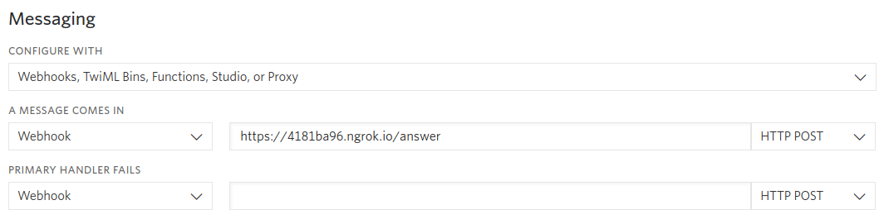

<a href="https://www.twilio.com">
  
</a>

# Send an SMS during a phone call. Powered by Twilio and Node/Express


> We are currently in the process of updating this sample template. If you are encountering any issues with the sample, please open an issue at [github.com/twilio-labs/code-exchange/issues](https://github.com/twilio-labs/code-exchange/issues) and we'll try to help you.

## About

Learn how to send an SMS to someone who's called your Twilio phone number while they're on the call.

This small sample application will say a short message to an inbound caller and, at the same time, send them an SMS. This project is built with [Nodejs](https://nodejs.org/) and [Express](https://expres-sjs.com/) and the [Twilio Node Helper Library](https://www.twilio.com/docs/libraries/node).

[Read the full tutorial here!](https://www.twilio.com/docs/sms/tutorials/send-sms-during-phone-call-node)

Implementations in other languages:

| .NET | Java | Python | PHP | Ruby |
| :--- | :--- | :----- | :-- | :--- |
| [Done](https://github.com/TwilioDevEd/send-sms-during-inbound-calls-csharp)  | [Done](https://github.com/TwilioDevEd/send-sms-during-inbound-calls-java)  | [Done](https://github.com/TwilioDevEd/send-sms-during-inbound-calls-python)  | [Done](https://github.com/TwilioDevEd/send-sms-during-inbound-calls-php) | [Done](https://github.com/TwilioDevEd/send-sms-during-inbound-calls-ruby) |

## Set up

### Requirements

- [Nodejs](https://nodejs.org/) v10 or v12

### Twilio Account Settings

This application should give you a ready-made starting point for writing your own application.
Before we begin, we need to collect all the config values we need to run the application:

| Config Value | Description            |
| :----------- | :----------------------|
| TWILIO_ACCOUNT_SID  | Your primary Twilio account identifier - find this [in the Console](https://www.twilio.com/console) on project settings. |
| TWILIO_AUTH_TOKEN | Used to authenticate - [just like the above, you'll find this here](https://www.twilio.com/console) on project setting. |

## Local development

1. First clone this repository and `cd` into it.

   ```bash
   git clone https://github.com/TwilioDevEd/send-sms-during-inbound-calls-node.git
   cd send-sms-during-inbound-calls-node
   ```

2. Install the dependencies.

    ```bash
    npm install
    ```

3. Copy the sample configuration file and edit it to match your configuration.

   ```bash
   cp .env.example .env
   ```

   See [Twilio Account Settings](#twilio-account-settings) to locate the necessary environment variables.

4. Start the server, the following command will run the application on port 8000.

    ```bash
    npm start
    ```

5. Expose the application to the wider Internet using [ngrok](https://ngrok.com/). This step **is important** because the application won't work as expected if you run it through localhost.

    ```bash
    ngrok http 8000
    ```

6. Configure Twilio to call your webhooks. 

   You will need to configure Twilio to call your application when calls are received in your [*Twilio Number*](https://www.twilio.com/console/phone-numbers/incoming). The Voice URL should look something like this:

   ```
   https://4181ba96.ngrok.io/answer
   ```

   

That's it!

### Tests

You can run the tests locally by typing:

```bash
npm test
```

### Cloud deployment

Additionally to trying out this application locally, you can deploy it to a variety of host services. Here is a small selection of them.

Please be aware that some of these might charge you for the usage or might make the source code for this application visible to the public. When in doubt research the respective hosting service first.

| Service                           |                                                                                                                                                                                                                           |
| :-------------------------------- | :------------------------------------------------------------------------------------------------------------------------------------------------------------------------------------------------------------------------ |
| [Heroku](https://www.heroku.com/) | [](https://heroku.com/deploy)                                                                                                                                       |

## Resources

- The CodeExchange repository can be found [here](https://github.com/twilio-labs/code-exchange/).

## Contributing

This template is open source and welcomes contributions. All contributions are subject to our [Code of Conduct](https://github.com/twilio-labs/.github/blob/master/CODE_OF_CONDUCT.md).

[Visit the project on GitHub](https://github.com/twilio-labs/sample-template-nodejs)

## License

[MIT](http://www.opensource.org/licenses/mit-license.html)

## Disclaimer

No warranty expressed or implied. Software is as is.

[twilio]: https://www.twilio.com
